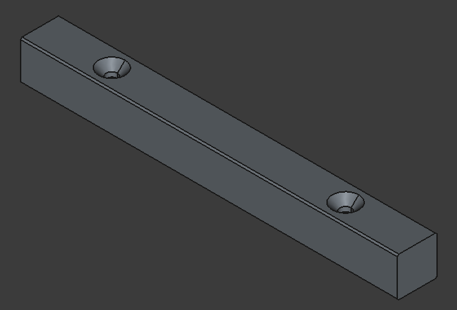
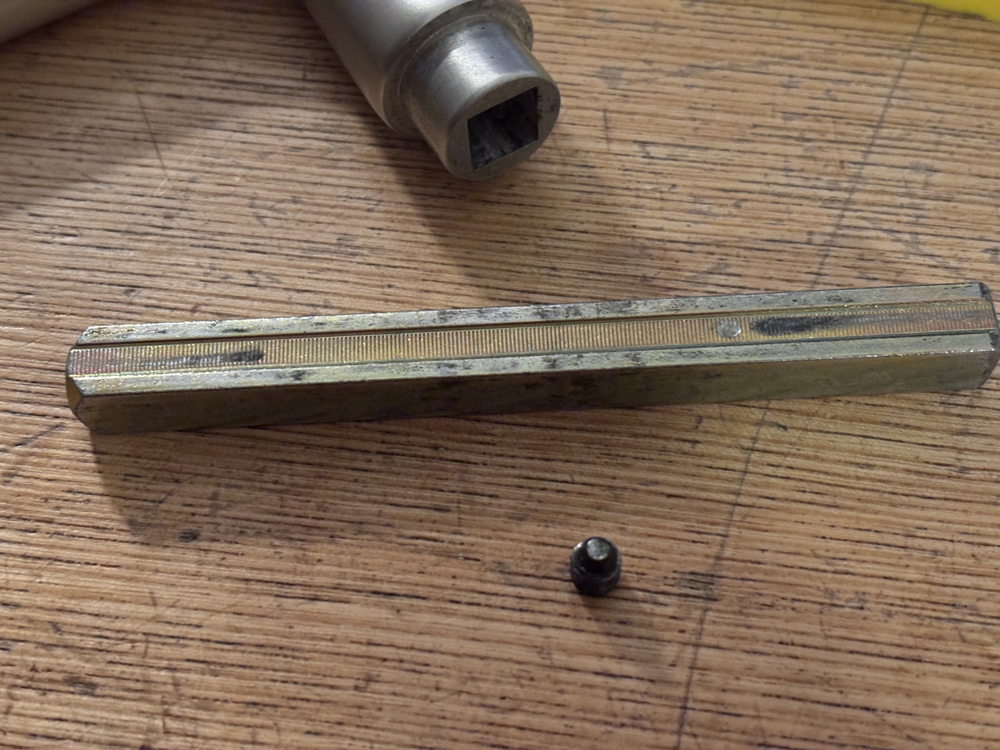
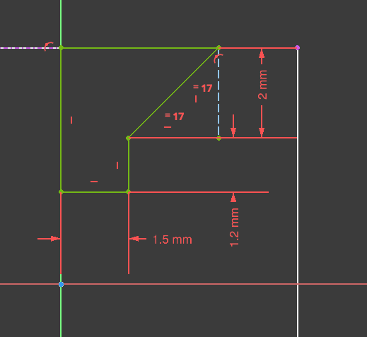
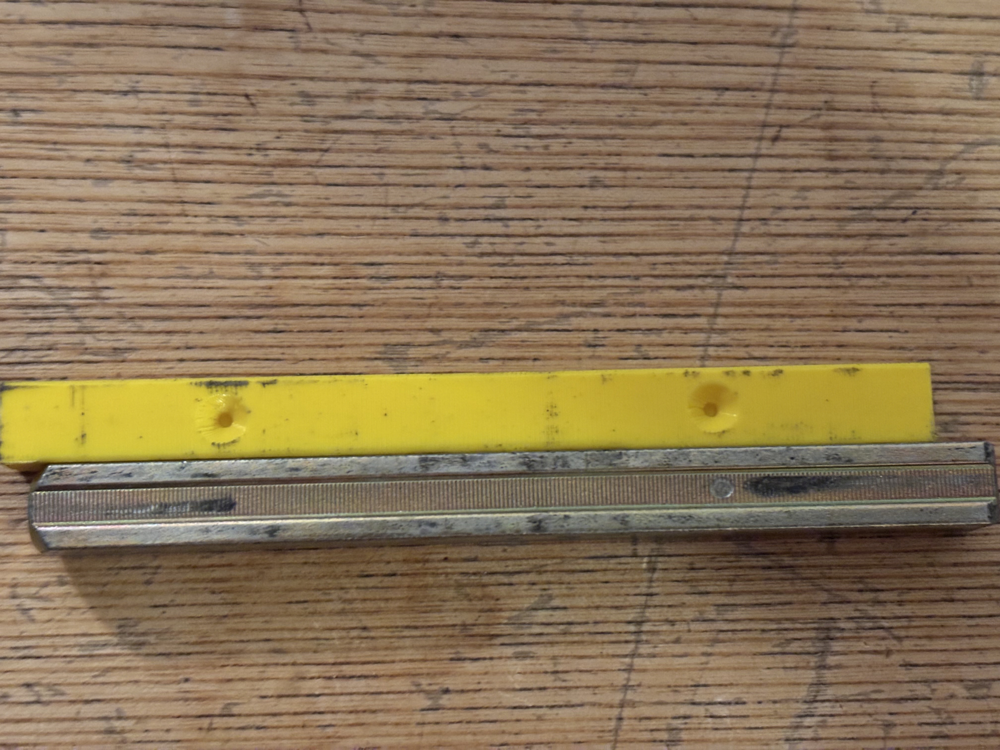
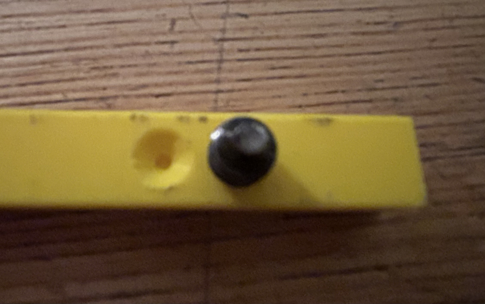

# Door Handle Bolt

---

My door handles keep coming lose. After some investigating, I found that that the set screws of the door handles only apply friction to the central bolt and that this is quite flat. I have tried to increae the pressure by tightening it, but that didn't help. 

The idea is that I can pint a grove into a new bolt, so that the set screws hold on with more than just friction. I do realize that the plastic might snap, but not in a way that would permanently damage the door. I think it's worth a try.

### Grove

Here is the sketch of the grove

### Version 1 Problems

The holes are offset. My original assumption that bolt is symetric was wrong. The bolt slides into the handles different. One deeper than the other. I also used the wrong set screw imprints. 

In addition, the print didn't end up with the dimension expected. I will simply assume that the printing process is perfectly repeatable, and that the problem is due to the slicer. I will compenstate by increasing the bolt size and the grove size.

